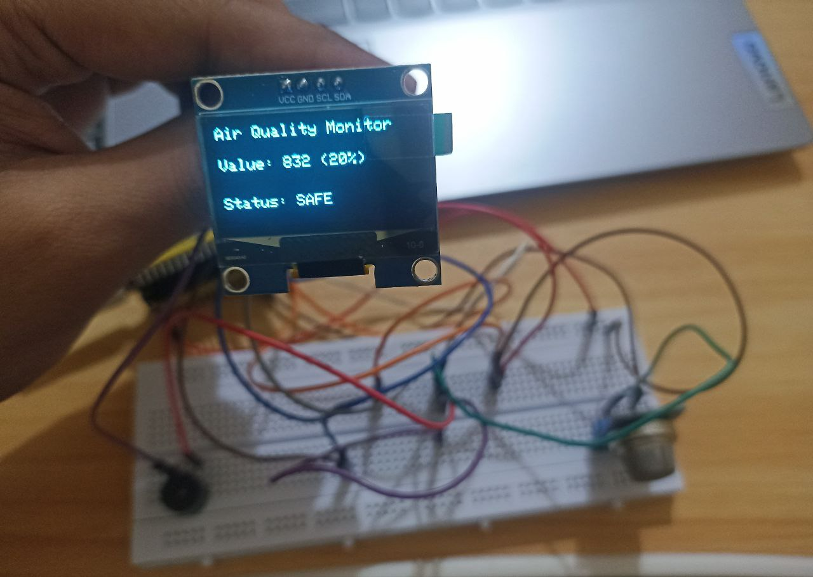
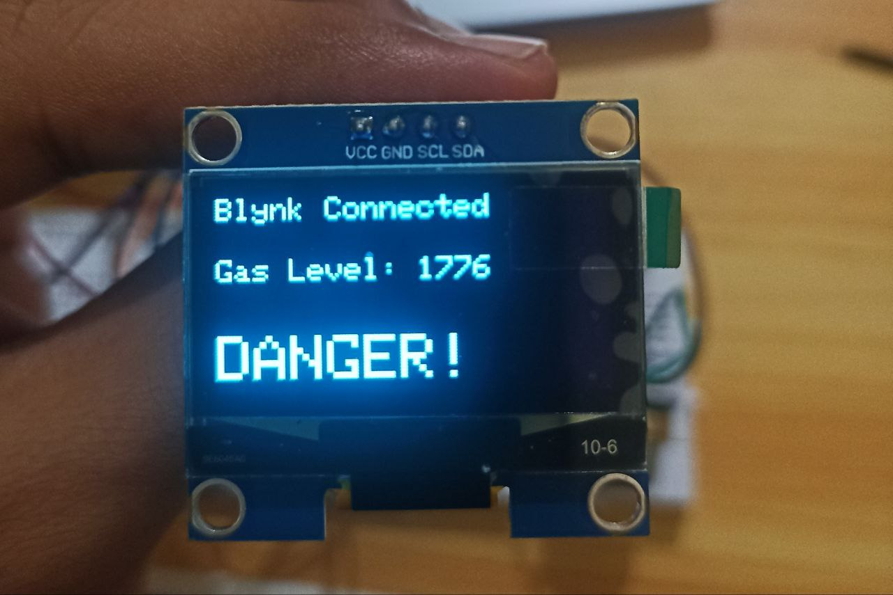
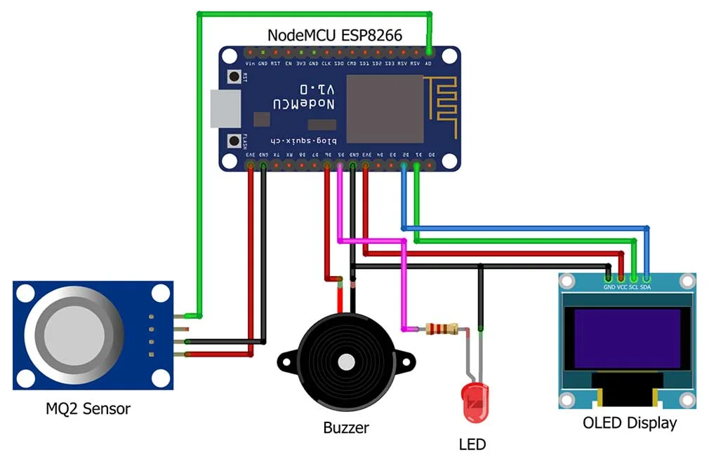

# IoT Real-Time Gas and Smoke Detection System
### Low-Cost LPG, Smoke, and Carbon Monoxide Monitoring with ESP32

## Overview
This project is a compact, low-cost IoT system built to detect LPG, smoke, and carbon monoxide in real time.  
It uses an ESP32 microcontroller paired with an MQ-Series gas sensor and provides three independent alert layers:

- Visual alerts using an OLED display  
- Local audio alerts with a buzzer  
- Remote notifications via the Blynk IoT Cloud  

Even without an active internet connection, local alerts continue to function, ensuring uninterrupted safety.

---

## Screenshots

### Hardware Build
  

### Blynk Dashboard

---

## Features
- Real-time monitoring of gas concentration  
- Threshold-based alert system  
- Online dashboard and remote notifications through Blynk  
- Local buzzer and OLED alerts even if Wi-Fi is offline  
- Compact, low-power architecture suitable for continuous operation  

---

## Hardware Required
- ESP32 Development Board (DOIT DevKit V1)  
- MQ-2 or MQ-135 Gas Sensor  
- 0.96" or 1.3" I2C OLED Display  
- Active or Passive Buzzer  
- Jumper wires and breadboard  

---

## Circuit Diagram
Store the diagram inside a folder named `diagrams/`.

---

